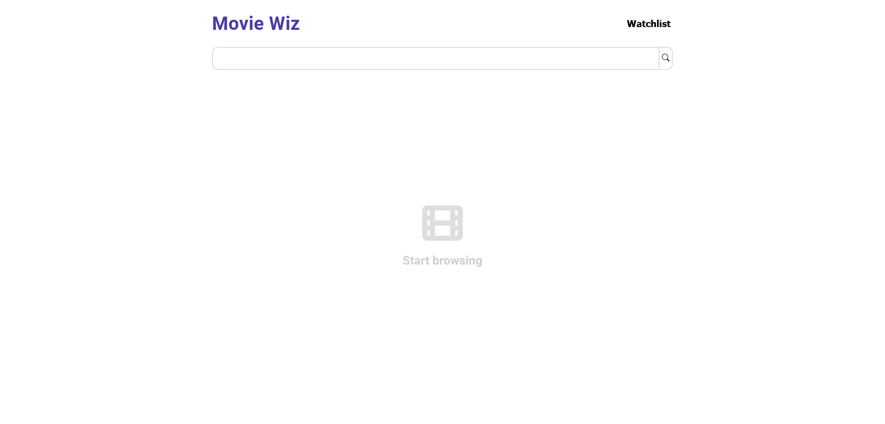
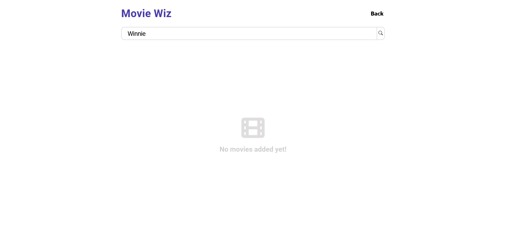
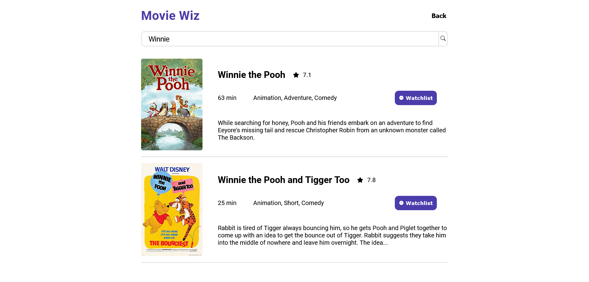

# Movie Wiz - A movie search interface

Movie Wiz is a simple movies UI it communicates with the omdb API to get your results.
Live view at: https://saragadalmawla.github.io/MovieSearch/

## Table of contents

- [Overview](#overview)
  - [The challenge](#the-challenge)
  - [Screenshot](#screenshot)
- [My process](#my-process)
  - [Built with](#built-with)
  - [Continued development](#continued-development)

## Overview

### The challenge

Users should be able to:

- Type a title they would like to find
- Press enter or click the search icon to start the search
- Get matching results
- Add movies to the watchlist
- Navigate to different pages

### Screenshots

#### Start page

#### Results rendered

#### Empty watchlist

#### Watchlist

#### Mobile view

## My process

### Built with

- Semantic HTML5 markup
- CSS custom properties
- Flexbox
- React V18.2
- The Open Movie DB omdb (a RESTful API)

### Continued development
- Add filtering 
- Add a dark mode
- Enhance responsiveness

